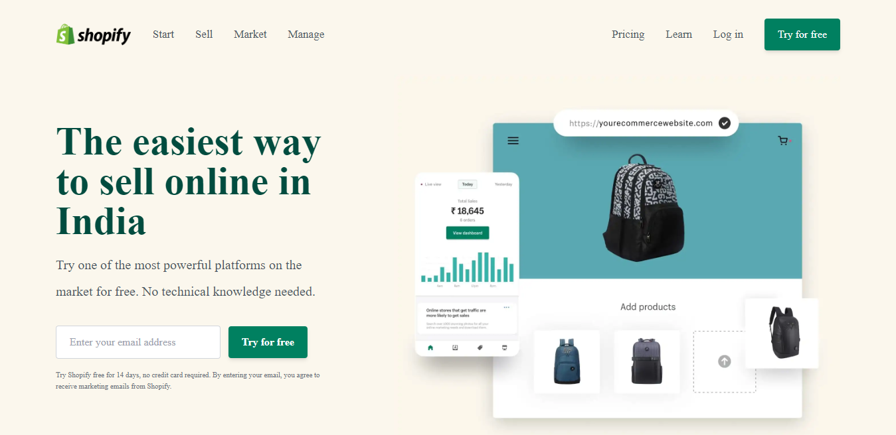
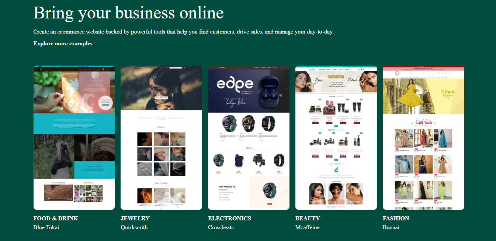
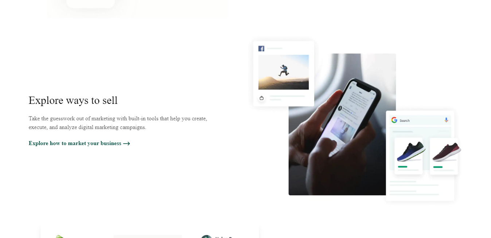
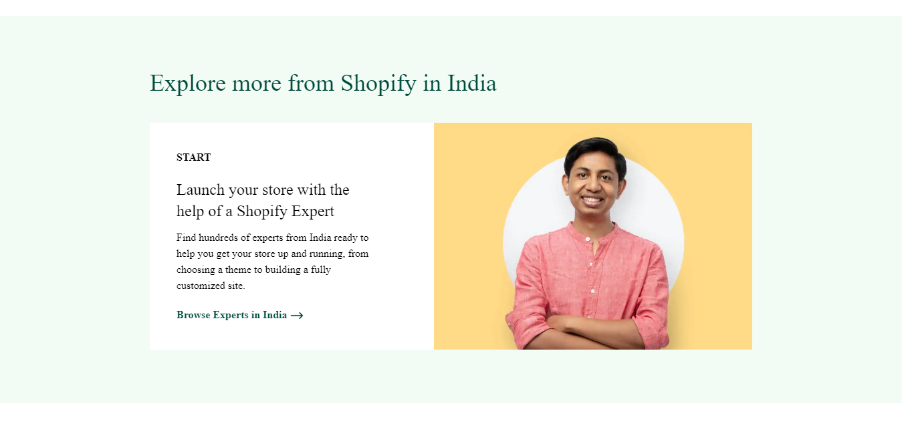
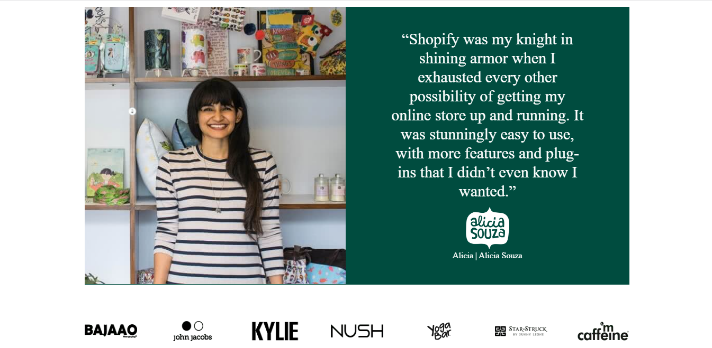
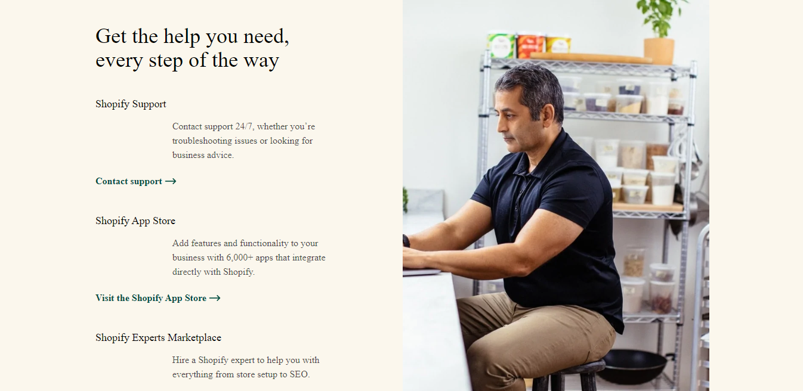
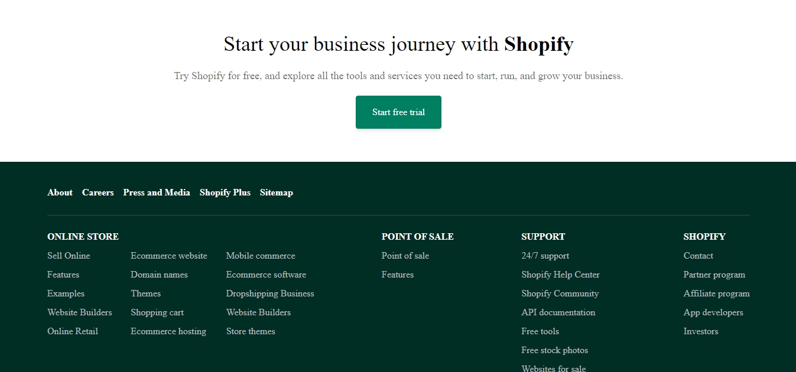

<!-- Social Links -->

[![LinkedIn][linkedin-shield]][linkedin-url]
[![Instagram][instagram-shield]][instagram-url]
[![Hashnode][hashnode-shield]][hashnode-url]

>

> # A Complete Shopify Clone Using `TAILWINDCSS` 😎

# **Gained expertise through this project :**

- Learnt indepth of tailwindCSS.

># Designed With 😇
>## TECHNOLOGIES USED 
>

>## Making Use of Tools
>
>
>
>
>
# Reminder 😮

>## I spent roughly around  6 to 7  hours finishing this project. The most of my time was focused on CSS Portion. And this is a `Responsive Design`.

# HERE IS THE PREVIEW HOW THIS PROJECT LOOKS😍
># [LIVE [HOSTED] PROJECT LINK](https://brijesh8128-shopify-clone.netlify.app/ "Shopify-clone-Netlify")
>
>
>
>
>
>
>

>## For any query you can reach out at brijeshvadaliya1@gmail.com I am happy to help 😎

# HAPPY LEARNING 🤩
>
>## I think it's fair to say that personal computers have become the most empowering tool we've ever created. They're tools of communication, they're tools of creativity, and they can be shaped by their user.

<!-- Linkedin -->

[linkedin-shield]: https://img.shields.io/badge/-LinkedIn-black.svg?style=for-the-badge&logo=linkedin&colorB=0B5FBB
[linkedin-url]: https://www.linkedin.com/in/brijesh-vadaliya-16b3a2202/

<!-- Instagram -->

[instagram-shield]: https://img.shields.io/badge/Instagram-%23E4405F.svg?style=for-the-badge&logo=Instagram&logoColor=white
[instagram-url]: https://www.instagram.com/brijesh_vadaliya_8128/

<!-- Hashnode -->

[hashnode-shield]: https://img.shields.io/badge/Hashnode-2962FF?style=for-the-badge&logo=hashnode&logoColor=white
[hashnode-url]: https://brijeshvadaliya8128.hashnode.dev/

<!-- Project screenshot -->

[product-screenshot]: /readme_assets/project01.jpg
[project-url]: https://trending25.netlify.app/
